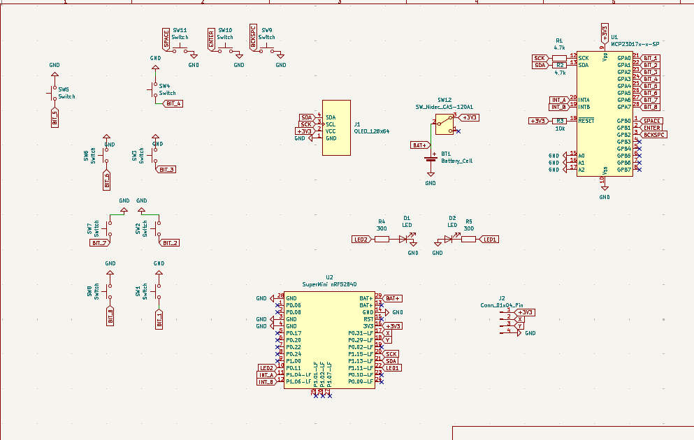
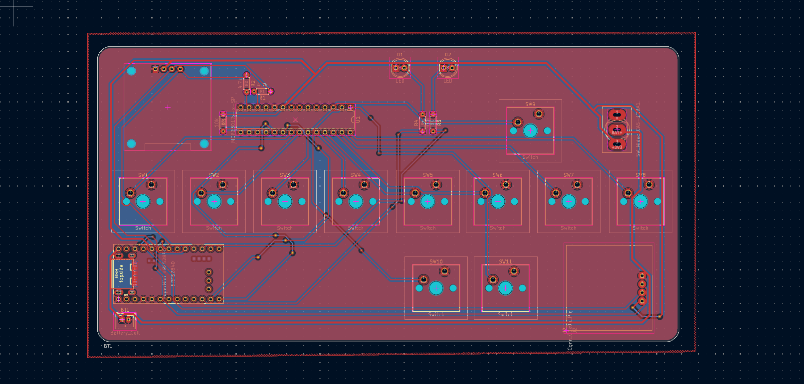
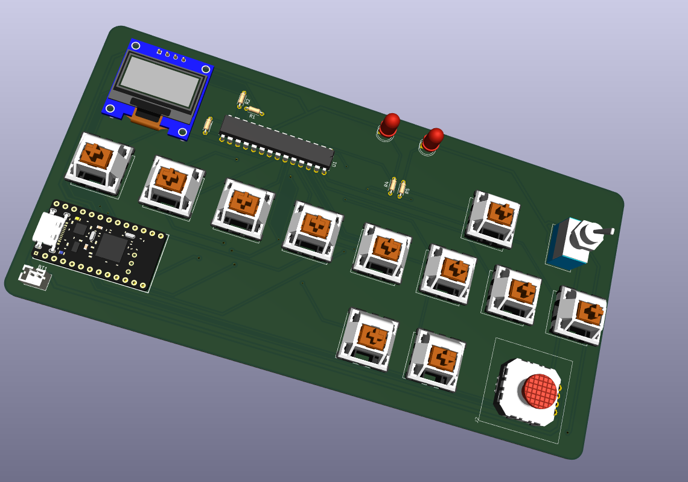
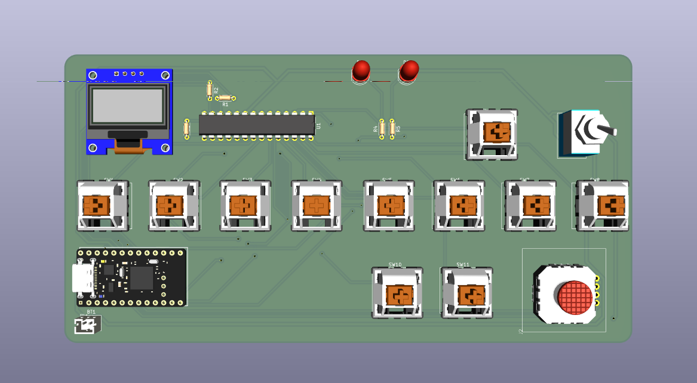
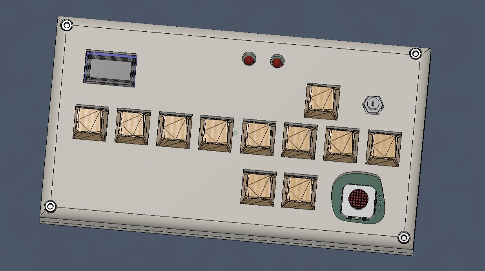
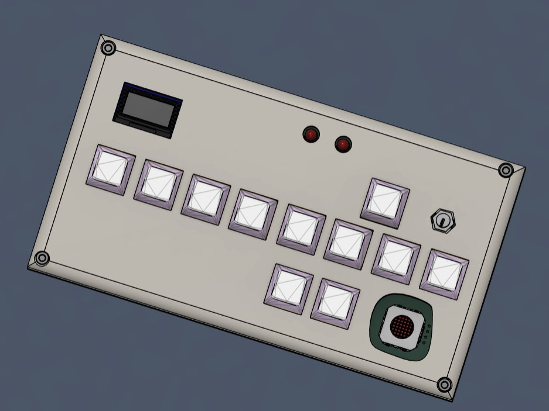

# Binary Keyboard


This is wacky, silly project where you can type your keyboard inputs in binary and send it to a connected device. You can enter the byte values (8 switches represent 8 bits in a byte) which represents a character. Then you confirm your input with the enter switch to covert that binary byte to a character to send to your device (wired or wireless!). Basically a keyboard but you type in binary because why not! It uses the SuperMini nRF52840 mcu ( a nice!nano clone) which supports bluetooth connectivity for you to send your inputs wirelessly.


## Motivation
I build the binary keyboard just for the sake of learning. No other motives. Its just a very stupid and fun idea which struck me and there I went building :)

## PCB







## 3D case




##  Project Structure

```text
├── 📁 3d_models
│   ├── 📁 Fusion 360     # Contains the .f3d files and STEP files
│   └── 📁 PCB export     # The 3d file exported from KiCad
├── 📁 KiCad              # Contains the KiCad schematics and PCB files 
├── 📁 Firmware
│   ├── 📁 Circuit Python # Contains the uf2 file that is to be flashed to the supermini
│   ├── 📁 lib            # Contains a zip file for the circuitpython firmware
│   └── 📄 code.py        # Contains the main code
└── 📁 BOM
    ├── 📄 kicad.csv      # KiCad generated CSV (no price present)
    └── 📄 BOM.cBOM mnaully created with price and total estimation
```


## How it works 
There are an array of 8 switches that are connected to the GPA0 to GPA7 of the MCP23017 gpio expander. The GPB0 has three connections - (SPACE, BACKSPACE and ENTER). There are intrerrupts for both of them which are conencted to gpios of the mcu. Whenever a user presses a button (any of the 8 buttons that repsresnt 1 bit of a byte for a single char) the state is changed for that bit's value. So if it was a 0 it changes to 1. Like that we can toggle each of the bits state and at the end press the enter button to confirm the data input. Then the python script (code.py) converted the byte to a char by mapping it to a character and returns it to the USB_HID device for it to be printed on your screen.

## How to make it work for you
First print the PCB. Print the 3d case. Then solder the parts in place. For the firmware- flash the uf2 file in the supermini. Then install the firmware into the mcy by unzippping the file inside /Firmware/lib. And upload the code.py file to begin testing and using the device.    

## AI USE
For firmware guidance and the code.py file code. Teensy help on fusion on selecting screw and other minor stuff. And small help for debugging kicad schematic and suggestions for improvements.